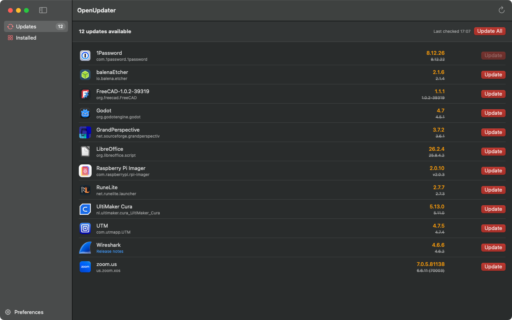

  
  <h1>OpenUpdater</h1>
  
<strong>Keep every Mac app up to date — from one open, community-driven source.</strong>

OpenUpdater is a lightweight macOS menubar app that scans the apps in your `/Applications` folder,
finds newer versions, and updates them in a click. It isn't limited to App Store or any single
package manager — it covers regular Mac apps: GitHub releases, Sparkle-based apps, and direct
downloads.

OpenUpdater provides a crowdsourced, community-maintained set of update sources. Coverage grows as
people add recipes, so OpenUpdater can keep up with apps that have no built-in updater of their own.

  

## Features

- 🔍 **Automatic scanning** — reads your installed apps and checks each for a newer version.
- 🔄 **Per-app re-scan** — re-check a single app on demand, so updates applied elsewhere are picked
  up right away.
- ⬆️ **One-click updates** — download, verify, and replace an app in place. Update one, several, or
  all at once.
- 🧩 **Works with many sources** — GitHub Releases, Sparkle appcasts (auto-detected), and direct
  HTTP/JSON/XML/YAML version feeds.
- 🪶 **Lives in your menubar** — a quick popover for a glance, plus a full window for the details.
- 🔔 **Release notes** — jump straight to an app's changelog before you update.
- 🙈 **Ignore lists** — silence an app entirely, or skip just one version you don't want.
- 🧭 **Spot the gaps** — see which apps have no update source yet, and report them in a click to
  help grow coverage.
- 🧪 **Pre-releases** — opt into beta/pre-release builds on a per-app basis.
- 🌿 **Release channels** — for apps with more than one stream (Firefox/Thunderbird ESR, LibreOffice
  Fresh/Still, Blender LTS, …), pick which one to track per app.
- 🔐 **Optional GitHub token** — raises GitHub's rate limit for faster, more reliable checks (stored
  encrypted in your Keychain).

## Installation

1. Download the latest **`OpenUpdater.dmg`** from the
   [Releases page](https://github.com/chenasraf/OpenUpdater/releases/latest).
2. Open the DMG and drag **OpenUpdater** into your **Applications** folder.
3. Launch it from Applications. OpenUpdater appears in your menubar (the two-arrows icon).

> [!NOTE]  
> The first time you open it, macOS may ask you to confirm. If it's blocked, right-click the app in
> Finder and choose **Open**, then confirm.

**Requirements:** macOS 13 (Ventura) or later.

## Usage

Click the menubar icon for a quick popover, or open the full window for the details, tabs, right-click
actions, and Preferences.

See **[docs/usage.md](docs/usage.md)** for the full guide, including how updates install and the
optional Background Helper.

## Contributing

Coverage grows through community-maintained **update recipes** — request an app, author one in the
app, or open a pull request. Most ways need no fork.

See **[docs/contributing.md](docs/contributing.md)** for the recipe format and all the ways to help.
